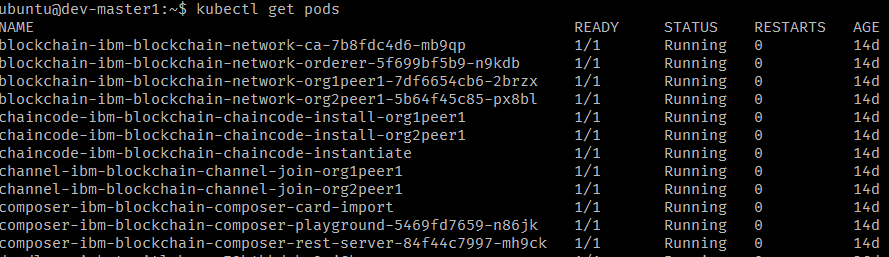
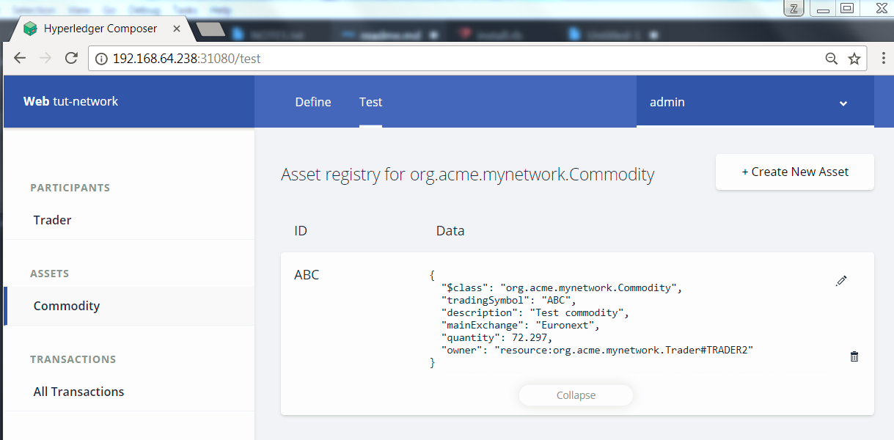
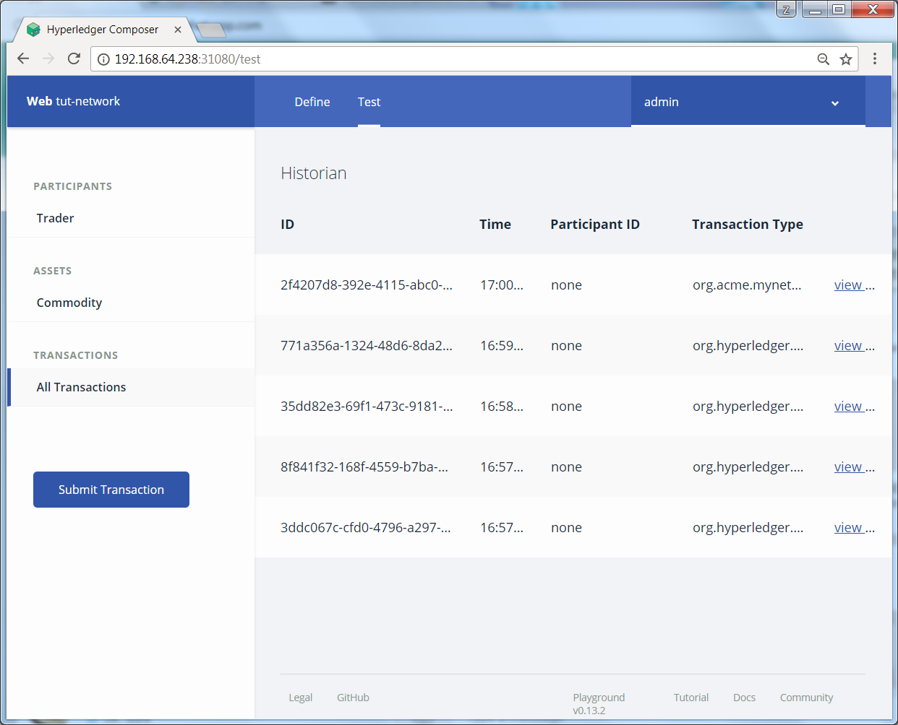

# Blockchain

This project explores running IBM Blockchain on IBM Cloud Private.

## Prerequisites
- ICP with Dynamic Storage Class provision configured. Eg. GlusterFS
- Helm client is installed and configured

## Deployment
The deployment will be based on the helm chart from  [IBM-Blockchain/ibm-container-service](https://github.com/IBM-Blockchain/ibm-container-service.git)

The steps are listed as below:

1. Clone the original repo (https://github.com/IBM-Blockchain/ibm-container-service.git) on a box where helm client is installed.
2. Update the following file `ibm-container-service/helm-charts/ibm-blockchain-chaincode/templates/_helpers.tpl`

Add in the following template at the last part of the file,
```
/* fix the missing template */
{{- define "ibm-blockchain-network.name" -}}
{{- default "ibm-blockchain-network" .Values.nameOverride | trunc 63 | trimSuffix "-" -}}
{{- end -}}
```
3. Deploy the helm charts in the following order

```
cd ibm-container-service/helm-charts
helm install --name blockchain --set persistence.storageClass=glusterfs-storage ibm-blockchain-network
helm install --name channel  ibm-blockchain-channel
helm install --name chaincode  ibm-blockchain-chaincode
helm install --name composer  ibm-blockchain-composer
```

>Change the storageClass name according to your environment settings

4. Monitor the deployment
  Examine the pvc are bound and wait for all the images are pulled, and all the pods are running. In my test environment, it took about 15 minutes to get all the pods running.

  

5. Find out what is the NodePort exposed for the composer playground. For example,

```
$ kubectl get services | grep blockchain-composer
composer-ibm-blockchain-composer-playground        NodePort    10.0.0.65    <none>        8080:31080/TCP                                 14d
composer-ibm-blockchain-composer-rest-server       NodePort    10.0.0.185   <none>        3000:31090/TCP                                 14d
```

- Now you can browse the composer-playground, such as

  http://192.168.xx.xx:31080


## Composer Playground
You can follow the [composer playground scenario](https://hyperledger.github.io/composer/tutorials/tutorials.html) step by step

Attached are some sample screen captures

- Trade2 is holding the Commodity

- History of transactions

